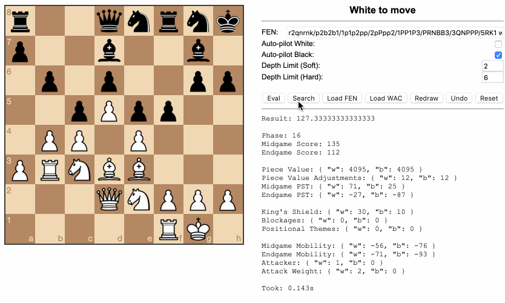

# chess-ai

Medium strength Chess AI implementation with node.js.



[Project Report](https://drive.google.com/file/d/0B0RFeAd0sIc6RzNOaHhRUFdCTnc/view?usp=sharing) | [Presentation](https://drive.google.com/file/d/0B0RFeAd0sIc6MjZWVGl4QS1nOXM/view?usp=sharing)

## Method overview

- Search: Traditional minimax with alpha-beta and node ordering. Also un-even tree generation.
- Evaluation features:
    - Piece values
    - Piece value adjustments
    - Piece square tables
    - King's shield
    - Blockages
    - Safe mobility
    - Attack count&weight

## Prerequisites

- Node.js (developed and tested with 6.9.1)
- A modern browser (developed and tested with Chrome 55)

## Setup

- Install dependencies with `npm i`

- Start chess engine backend

  ```bash
  npm start
  ```

- Start frontend

  ```bash
  npm run serve
  ```

  Open `http://localhost:8080/src/client` in your favorite browser

## Thanks

Special thanks to these projects that help me a lot in this.

- [Chess.js](https://github.com/jhlywa/chess.js)
- [Chessboard.js](http://chessboardjs.com/)
- [CPW](https://chessprogramming.wikispaces.com/)
